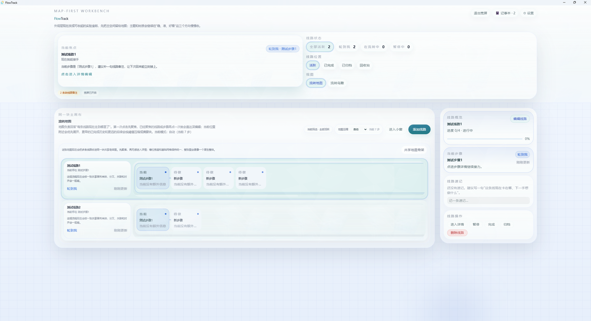
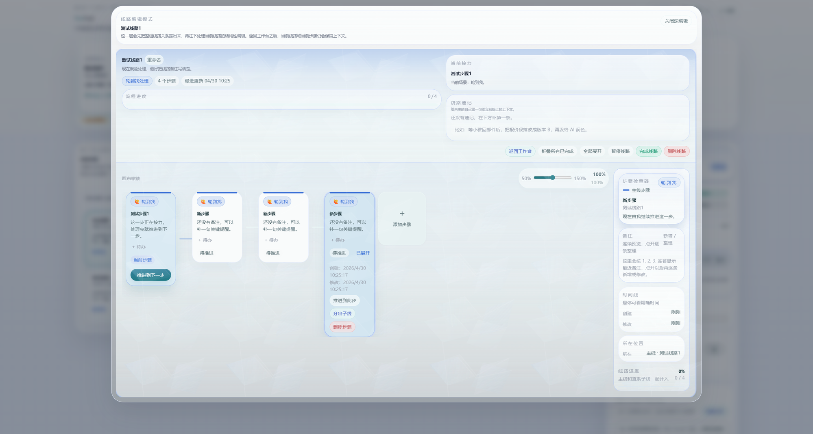
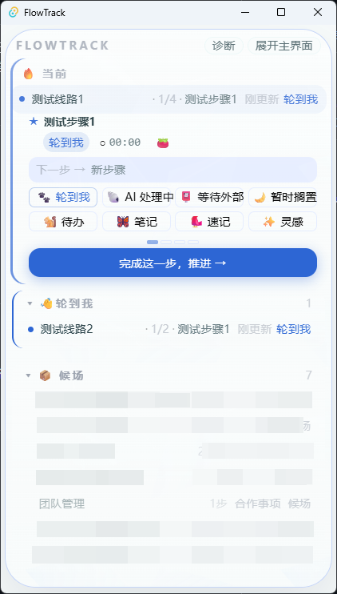

# FlowTrack

FlowTrack 是一个面向 AI 协作与多任务并行推进的本地桌面调度面板。它帮助你把多条正在流转的任务线路放在同一个工作台里，快速判断此刻该接手哪条线、哪一步正在等待 AI、外部反馈或自己继续推进。

## 下载

当前发布包：

- `FlowTrack_0.5.47_x64-setup.exe`

适用平台：

- Windows x64

## 安装

1. 下载 `FlowTrack_0.5.47_x64-setup.exe`。
2. 双击安装包。
3. 如果 Windows SmartScreen 提示未知发布者，请确认文件来源后选择继续运行。

## 界面一览

### 流转地图

多条线路并列展示，步骤以场景色区分——青色是"轮到我"，琥珀色是"等待外部"，灰色是"暂时搁置"。右侧面板可快速查看和编辑当前聚焦的线路。



### 线路详情

点击线路进入详情视图，查看每一步的状态、备注和操作入口。右侧面板展示步骤详情、时间戳与快捷动作。



### 小窗模式

小窗模式将当前任务、待处理线路和按场景分组的队列整合在一个轻量面板中，方便在 AI 协作时保持任务可见。



## 主要功能

- 多条任务线路并行管理
- 每条线路拥有独立步骤链
- 步骤场景区分：轮到我、AI 处理中、等待外部、暂时搁置
- 支持线路推进、回退、完成与归档
- 支持分支线路，用于表达一条主线中分出的并行任务
- 支持小窗模式，方便在日常 AI 协作时保持当前任务可见
- 数据保存在本地，便于备份和迁移

## 使用场景

FlowTrack 适合这些情况：

- 同时和多个 AI 会话推进不同任务
- 一个项目中有多条线路互相等待、穿插推进
- 需要快速判断“现在轮到谁处理”
- 不想把实时调度混进长期计划或知识库工具里

## 校验信息

当前安装包 SHA-256：

```text
eade6f90f058a47b04744b6a110af073d411531558e1f7217b29fdf63548dcfb
```

## 说明

这个仓库只用于发布 FlowTrack 的可安装版本，不包含源代码。

FlowTrack 仍在持续演进中，当前版本更适合个人工作流试用与反馈，不建议作为团队关键生产系统的唯一调度工具。
